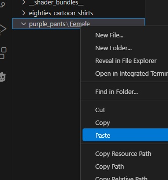

# Nerd Shirts Mod - Booster Developers Guide

## Legal

Before you get started, please note the following:

**This mod is a dependency.**  Do **not** include any of the files from this mod in your own.  All you will need to do is create a sub-folder of the *\<tcgshop-home\>/BepInEx/plugins/nerd_shirts* and make this mod a dependency when you release on Nexus.  (I also plan to add mesh support and an API if there is enough interest).

TL;DR for the rest of this mumbo jumbo.  Just be sure to keep my code as a dependency and don't cut/paste it into your stuff.  You are legally allowed to do exactly that with all of my stuff, since it is covered by the GPL and totally open, but if you do then you absolutely **must** 1) read the rest of this section, 2) make your stuff open source, and 3) adopt the GPL (you do this implicitly once you absorb the code).

With that said, this mod and all of my source code is licensed under the GNU Public License (GPL).  As such, you are free to download, modify, distribute the source code and generated artifacts as long as your end-product also adopts the GPL.  To put it simply, if you use any intellectual product (source or idea) covered by the GPL then your source must become open-source, and you may not release "black box" artifacts (binaries) which contain the intellectual property covered by the GPL.

However, this does **not** apply if you treat the GPL-covered tool/library as a dependency.  Black box and "commercial off the shelf" (COTS) software can legally (and very frequently do) use open-source software covered by the GPL and other open-source licenses.

That's the short(ish) version.  Read the GPL (the LICENSE file in this repo) for full info.

## Quick Unity Primer

A *very* brief overview of Unity objects to explain the terms to the neophytes:
* Pretty much everything visual in Unity is made up of **GameObject**s, which are just a generic thing that has a **Transform** which defines the object's parent and its place/rotation in space.
* GameObjects don't have any functionality on their own.  The real work is done by **Components** which are specialized workhorses that belong to a specific GameObject.
* There are thousands of Components that define how GameObjects are shaped, move, and relate.  But we only need to worry about one (and not even much).
* **MeshRenderer** - the component that represents the *mesh*, or the set of verteces and triangle 'faces' that draw the visual object in 3D space.
* It's pretty simple.  MeshRenderers draw the faces and vertices using any number of **Materials**.  Materials can, in turn, be colors, images, metallic shine, tons of things.
* The meat and power behind materials is in the **Shader** it uses.  The shader defines a set of textures and the values that determine how it behaves.
* That is the (very) basic backbone of how the Unity engine renders a 3D object.

## How this Mod Works

Overview:

This mod loads any number of **Boosters**, which are represented by individual sub-folders of the *\<game\>/BepInEx/plugins/nerd_shirts* folder.  Each **Booster** can replace or add textures and will work alongside others, allowing mod developers to release Nexus mods containing boosters.  The Nerd Shirts loader will print warnings to the LogOutput.log file if there are conflicts.  More on **Boosters** later.

A quick explanation of how this mod makes it a little easier to understand how to make your own texture boosters.

Broad strokes:
1. When the game first launches, the mod scans the *\<game\>/BepInEx/plugins/nerd_shirts* folder for all sub-folders, which it will treat as boosters (with the exception of those beginning with '_', i.e. special dirs [explained later in the Advanced section]).
1. Each *booster* dir must have the same directory structure as the *__dump__* dir (explained later in the Creating a Booster sections).  The *__dump__* dir is just what it seems: a dump of the tree structure of the Unity objects in the game.
1. If a mod wants to say change the design on the "crop top" shirt for the female customers then the *booster* dir would include the ```Female\Crop_Top_01\Modular\Upper_Body\Crop_Top_01\Crop_Top_01_LOD0\renderer_000\material_000``` directory tree and contain the PNG image files that are modified to change the texture on the shirt.
1. The textures (and shader config JSON files) are loaded at game launch to be used when customer/worker models are instantiated.
1. As soon as customers are spawned (currently workers are not affected by this mod--coming soon) the mod checks the replaced texture tree against the Unity object tree within the model.  All matches of the texture are replaced.
1. This mod will also add materials to renderers (like the decals packaged with the mod) if they are defined under a renderer directory as such: *renderer_000/\_\_add\_\_*.  The properties for these materials are defined in \_\_shader\_\_.json config files.

## Suggested Tools / Knowledge

(All of these are free)

* **GIMP**: This is probably the only tool you really need if you're just modifying or creating decal PNGs.  I am terrible at anything visual, but GIMP is pretty easy to use for the simple stuff and really good for dealing with PNG layers.
* **Visual Studio Code**: This one is not needed, but it is really nice to have for versatility in navigating the deep directory trees, editing JSON files, and a variety of other personalizable components.
* **Unity**: A cursory knowledge of the workings of Unity will really help.  You definitely don't need to follow the tutorials that show you how to use the editor and all that.  It's more the concept of GameObjects, Meshes, Renderers, Materials, and Shaders that really helps.  It is worth the effort to download and install Unity to just play around with making a GameObject and changing the materials/shaders, etc.
* **Notepad++**: Personally I think VScode beats this one in everything, but lots of folks love it, and obviously it is a million times better than Notepad (cringe).  It is a good tool and works great for just watching live log files.

## Creating a Booster - Overview

A general overview of the process of creating a booster for this game is as follows:

1. Dump the game textures using this mod.
1. Create a booster sub-folder under the plugins/nerd_shirts directory.
1. Copy one of the dumped directory trees into your booster directory.  Delete all but the textures you wish to modify.
1. Add materials / textures using the \_\_add\_\_ and \_\_shader\_\_.json, if desired.
1. Test out in the game by using the *Force Wear* setting and specifying the modified apparel type(s).
1. Zip up your booster sub-folder and share with the world!

## Dumping Game Textures and Exploring File Structure

The first step is to dump all of the game textures.  This mod has a configurable built-in hotkey (default Ctrl+F8) to trigger the dump in-game.  The hotkey only works if the mod is is "Test Mode".  Here are the steps:

1. Open the mod cfg file, *devopsdinosaur.tcgshop.nerd_shirts.cfg*, search for "Test Mode - Enabled" and set it to true.
1. Start the game and load any savegame.
1. Hit Ctrl + F8.  The mod will take a minute or so (or more, depends on your machine) to dump all of the game textures to your hard drive in the *\<tcgshop-home\>/BepInEx/plugins/nerd_shirts/\_\_dump\_\_* directory.  Text will appear in the upper-left section of the screen to show progress.
1. The game will close automatically when it's done.
1. Open up the *\<tcgshop-home\>/BepInEx/plugins/nerd_shirts/\_\_dump\_\_* in either Visual Studio Code (best option) or Windows Explorer.
1. Take some time to explore the layout and the image files.  As you will see, they are organized by: Gender => Body Part => Renderer => Material.  The directory tree seems redundant and excessively deep, but it exactly mirrors the hierarchy of the game objects.  VSCode combines empty parts of the tree on a single line (as shown in this image):
*   It makes it **so** much easier to navigate the directory trees.  You can also right-click on any directory / file and "Reveal in File Explorer" to open the directory in Windows Explorer.  

## Creating a Simple Texture Replacement Booster

This mini guide will demonstrate making a very simple nerd_shirts booster which turns customers' blue jeans purple.

1. Keep your VSCode / Windows Explorer window from the previous section open to *\<tcgshop-home\>/BepInEx/plugins/nerd_shirts/\_\_dump\_\_*.
1. Open up a new VSCode / Windows Explorer window and "Open folder..." to *\<tcgshop-home\>/BepInEx/plugins/nerd_shirts*.
1. Create a new folder called *purple_pants* under *\<tcgshop-home\>/BepInEx/plugins/nerd_shirts*.  R-click the empty space in the file explorer window as shown here:
* 
1. R-click the new *purple_pants* folder and add a "New Folder..." called *Female*, as follows: 
* 
1. Go back to the other (\_\_dump\_\_) workspace / window.
1. Open the *Female* folder and R-click => Copy the *Jeans_Blue_01_F* directory tree, like this:
* 
1. Tab back to the (purple_pants) workspace and R-click the *Female* directory and => Paste into the *Female* directory like this:
* 
1. Now you should have a directory tree that looks like this: 
* 
1. At this point you now have a booster folder which tells nerd_shirts to replace all of the female customers' blue jeans with the textures in your directory tree.  But it currently would just replace them with the exact same textures.  So let's change one of them to get that purple tint!
1. Navigate down to the *purple_pants\Female\Jeans_01_F Blue\Modular\Lower_Body\Jeans\Jeans_LOD0\renderer_000\material_000* directory and R-click => "Reveal in File Explorer" to open it up in Windows Explorer.
1. In Windows Explorer, R-click "_Base_Color.png" => Open with => GIMP.
1. If you don't know GIMP (which I really don't, to be honest) it can be almost as intimidating as Photoshop or AutoCAD, but luckily it's really easy to figure out most things with Google... and we're just changing the color tint for now.
1. In the menu, click Colors => Hue-Chroma... as shown here:
* 
1. Drag the "Hue" bar to the right a ways until the pants turn a nice purple and click OK.
1. Hit Ctrl + Shift + E (or File => Export As...) to export the image.  Hit Enter (or click "Export") and confirm that you want to "Replace" the original image.  Then click "Export" again on the last popup to *finally* actually export the file =)
1. So now you've got a new pair of purple pants to show off in-game.
1. There are three other handy settings for testing textures/materials with the Nerd Shirts Mod.  We'll use them now.
1. Open up the mod config file (*\<tcgshop-home\>/BepInEx/config/devopsdinosaur.tcgshop.nerd_shirts.cfg*) and search for "Force Wear".  Reading the description text you can see it is specifically designed for testing textures as you add/modify them.
1. Set ```Force Wear = Jeans_Blue_01```  You might be asking, "Why is it not 'Jeans_Blue_01_F', like in the directory structure.  Why?  Because the "Force Wear" setting specifies the name of the "apparel" and not the name of a texture that belongs to that apparel item.
1. Save the cfg file and start up the game and load any savegame.  Hit Escape to pause, tab out, and open up *\<tcgshop-home\>/BepInEx/LogOutput.log* in VSCode or Notepad++.  Search for "Force Wear", and you'll see a log entry that gives a complete list of all the Apparel items grouped by associated Gender and Body Part.  (Note that I added a placeholder for Non-binary gender type because I plan to add that capability in the near future, but there is nothing in there yet.)  Anyway, when you are testing your textures later, this will be the list you'll use to put the clothes on the customers.  In the list in your log you should see this:

```
++ Female: Legs ++

Jeans_Baggy_Black
Jeans_Baggy_Blue
Jeans_Black_01
Jeans_Blue_01 [** FORCE **]
Jogging_Pants_01
Skirt_Gray
```

1. This indicates that the mod is attempting to force the female customers to wear the blue jeans, where possible.  I say "where possible" because not all customer "presets" (the predesigned model templates) support wearing all types of apparel.  The jeans seem to work with most (and you'll notice in the log that the Male: Legs section also indicates the dudes will be sporting jeans as well, cuz it's the same name =), but things like the Skirt_Gray only work on one or two presets.
1. So that gets us to the next feature of this mod.  You're thinking now, "Do I have to wait around for a customer to spawn that happens to support the apparel I'm testing?"  The answer is no! (would have been a real letdown and kinda embarassing for me if the answer had been different...)
1. Tab back to the game and un-pause.  If you had customers in your shop when you saved then you may just have some folks with purple pants hanging around.  But lets say you don't or you're testing to see if your textures work with ALL the presets.  Hit Ctrl + Z and watch the purple-pantsded(?) zombie army appear from nowhere!  This hotkey causes all of the customer presets to spawn on the street outside of your shop.  They don't walk, just do their creepy sync'd up idle animations and hold all their random stuff, like this:
* 
1. Hit Ctrl + X to despawn all the zombies.  You can spawn and despawn them as much as you want.  You can also hit Ctrl + Z to spawn them on top of one another and see cool multi-headed animation effects (though with old dinosaur [pun intended] CPUs like mine it will start killing framerate).
1. So there you go.  You've made your first nerd_shirts booster!  Go forth and make lots of cool ones.  I can't wait to see them!  But you might also want to read the next section on adding materials to do even more =)

